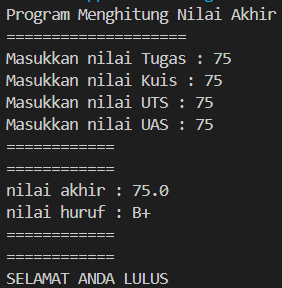
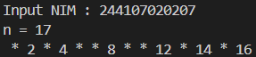
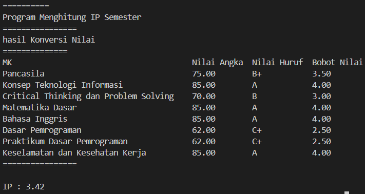
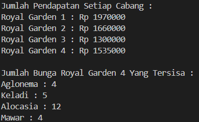
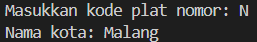
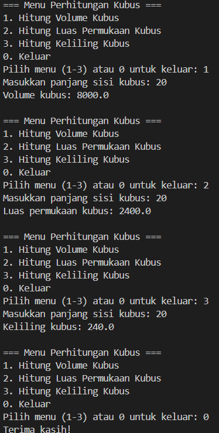
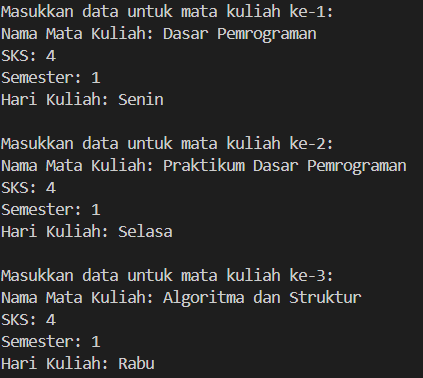
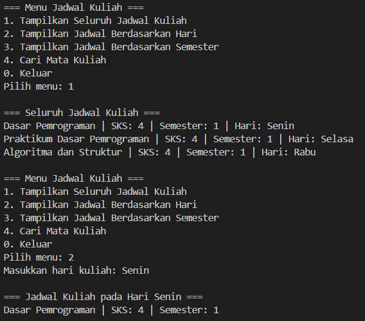
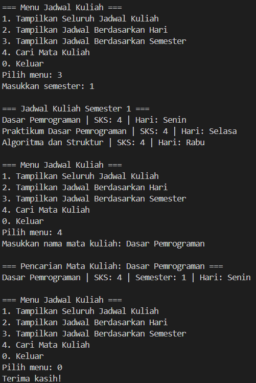

|  | Algorithm and Data Structure |
|--|--|
| NIM |  244107020207 |
| Nama |  Adam Bahy Maulana |
| Kelas | TI - 1H |
| Repository | https://github.com/adambahyn/01_AdamBahyMaulana_PRAKALSD|

# Jobsheet 1

## Pemilihan

**Brief explanaton:** There are 4 main step: 
1. Input all grades
2. Validate the input
3. Calculate and convert the final number and alphabetical grade
4. Decide the final status

## Perulangan

**Brief explanaton:** There are 4 main step: 
1. Input NIM
2. Extract last two digits
3. Loop from 1 to digit2 
4. Print pattern

## Array

**Brief explanaton:** There are 4 main step: 
1. Initialize Data
2. Input Scores & Convert to Grades 
3. Calculate IP (GPA)
4. Display Results

## Fungsi

**Brief explanaton:** There are 4 main step: 
1. Initialize Data 
2. Calculate Total Revenue
3. Calculate Remaining Stock (Royal Garden 4)
4. Execute Functions in main

## Tugas 1

**Brief explanaton:** There are 4 main step: 
1. Initialize Data
2. Take User Input
3. Search for Matching Code
4. Handle Invalid Input

## Tugas 2

**Brief explanaton:**  
**1. Input all grades**
    - The program continuously displays a menu using tampilkanMenu() and waits for user input.
    - If the user enters 0, the program exits with a "Terima kasih!" message.
**2. Validate the input**

    - Option 1(Hitung Volume Kubus)
        - Asks for the cube's side length.
        - Calls hitungVolume(sisi), which calculates sisi^3.
        - Displays the volume result.

    - Option 2(Hitung Luas Permukaan Kubus)
        - Asks for the cube's side length.
        - Calls hitungLuasPermukaan(sisi), which calculates 6 * sisi^2.
        - Displays the surface area result.

    - Option 1(Hitung Keliling Kubus)
        - Asks for the cube's side length.
        - Calls hitungKeliling(sisi), which calculates 12 * sisi.
        - Displays the perimeter result.

**3. Invalid Input Handling**
**4. Program Ends When User Inputs 0**

## Tugas 3

**Brief explanaton:** There are 4 main step: 
1. Input Course Data → User inputs the number of courses and their details (name, SKS, semester, and lecture day).
2. Display Menu Options → Provides options to view the schedule, filter by day/semester, or search for a course.
3. Execute User Choice → Calls corresponding functions based on user selection.
4. Data Processing → Filters and displays data based on user queries (e.g., by day, semester, or course name).

