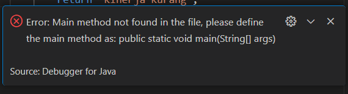
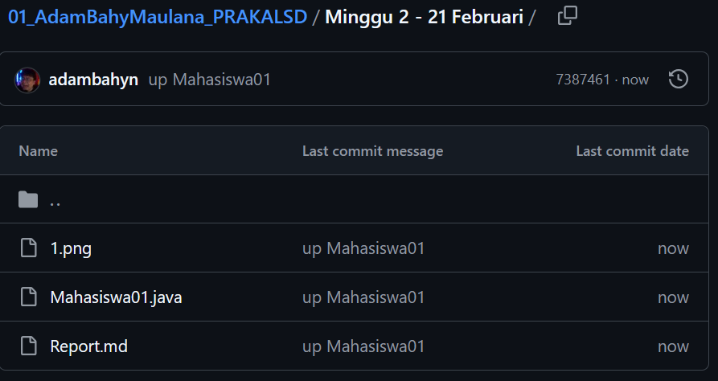
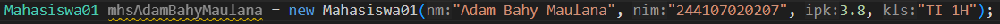
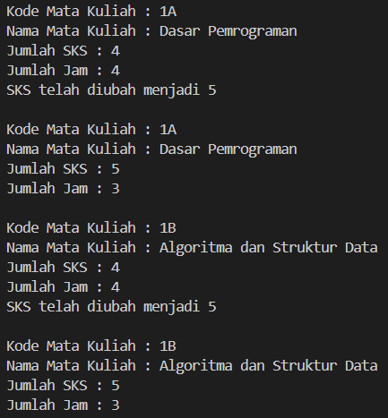

|  | Algorithm and Data Structure |
|--|--|
| NIM |  244107020207 |
| Nama |  Adam Bahy Maulana |
| Kelas | TI - 1H |
| Repository | https://github.com/adambahyn/01_AdamBahyMaulana_PRAKALSD|

# Jobsheet 2

## 2.1 Percobaan 1: Deklarasi Class, Atribut dan Method

### 2.1.3 Pertanyaan
1. Memiliki atribut dan method, berupa rancangan atau template dari entitas yang nyata, mempunyai metode khusus yaitu konstruktor
2. ada 4, nama, nim, kelas, dan ipk
3. ada 4, tampilkanInformasi(), ubahKelas(String kelasBaru), updateIpk(double ipkBaru), nilaiKinerja
4.   if (ipkBaru <= 0.0 && ipkBaru >= 4.0) {
            ipk = ipkBaru;
        } else {
            System.out.println("IPK tidak valid. Harus antara 0.0 dan 4.0");
        }
5. memeriksa nilai IPK dalam pemilihan if else if, dan mengembalikan String sesuai kondisi yang terpenuhi
6. 

## 2.2 Percobaan 2: Instansiasi Object, serta Mengakses Atribut dan Method

Fungsi Mahasiswa01 secara kesuluruhan
1. Menampilkan informasi mahasiswa melalui metode tampilkanInformasi().
2. Mengubah kelas mahasiswa dengan metode ubahKelas().
3. Memperbarui nilai IPK dengan validasi rentang (0.0 - 4.0) melalui metode updateIpk().
4. Menentukan kategori kinerja mahasiswa berdasarkan IPK dengan metode nilaiKinerja().

### 2.2.3 Pertanyaan

1. , nama object yang dihasilkan adalah mhs1
2. Atribut -> objek.atribut	; Method -> objek.method()	
3. Karena atribut kelas dan ipk dari objek mhs1 telah dimanipulasi

## 2.3 Percobaan 3: Membuat Konstruktor

### 2.3.3 Pertanyaan

1. 
2. Menginstansiasi objek mhs2 dari class Mahasiswa01 dengan parameter;
3. , karena di class MahasiswaMain01 terdapat konstruktor tanpa parameter
4. tidak, kita bisa mengakses atau menggunakan sesuai kebutuhan karena java menjalankan method sesuai urutan pemanggilan di main()
5. 

## 2.4 Latihan Praktikum

### 1. 
Fungsi MataKuliah01 secara keseluruhan :
1. Menampilkan informasi mata kuliah melalui metode tampilInformasi().
2. Mengubah jumlah SKS dengan metode ubahSKS().
3. Menambah jumlah jam pertemuan dengan metode tambahJam().
4. Mengurangi jumlah jam pertemuan dengan metode kurangiJam(), yang dilengkapi validasi agar jumlah jam tidak menjadi negatif.
### 2. 
Fungsi Dosen01 secara keseluruhan :
1. Menampilkan informasi dosen melalui metode tampilInformasi().
2. Mengubah status aktif dosen dengan metode setStatusAktif().
3. Menghitung masa kerja dosen berdasarkan tahun saat ini dengan metode hitungMasaKerja().
4. Mengubah bidang keahlian dosen dengan metode ubahKeahlian().
