|                | Algorithm and Data Structure                                                  |
| -------------- | ----------------------------------------------------------------------------- |
| **NIM**        | 244107020207                                                                  |
| **Nama**       | Adam Bahy Maulana                                                             |
| **Kelas**      | TI - 1H                                                                       |
| **Repository** | [GitHub Repository](https://github.com/adambahyn/01_AdamBahyMaulana_PRAKALSD) |

# Jobsheet 3

## 3.2 Membuat Array dari Object, Mengisi dan Menampilkan

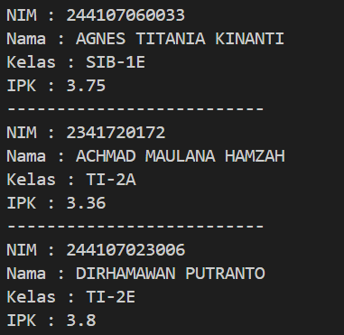

### **3.2.3 Pertanyaan**

1. **Berdasarkan uji coba 3.2, apakah class yang akan dibuat array of object harus selalu memiliki atribut dan sekaligus method? Jelaskan!**
   - Tidak harus selalu memiliki method, karena array of object dapat di instansiasi hanya dengan memanggil class lain.
2. **Apa yang dilakukan oleh kode program berikut?**
   - deklarasi array of object arrayOfMahasiswa dari class Mahasiswa
3. **Apakah class Mahasiswa memiliki konstruktor? Jika tidak, kenapa bisa dilakukan pemanggilan konstruktur pada baris program berikut?**
   - jika class tidak memiliki konstruktor, maka akan terbentuk konstruktor tanpa parameter secara default.
4. **Apa yang dilakukan oleh kode program berikut?**
   - pemberian nilai ke array of object arrayOfMahasiswa index 0
5. **Mengapa class Mahasiswa dan MahasiswaDemo dipisahkan pada uji coba 3.2?**
   - Agar tertata rapi.

---

## 3.3 Menerima Input Isian Array Menggunakan Looping

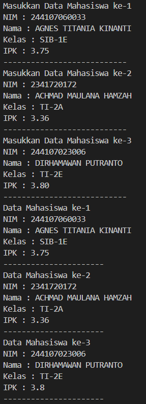

### **3.3.3 Pertanyaan**

1. **Tambahkan method cetakInfo() pada class Mahasiswa kemudian modifikasi kode program pada langkah no 3**
   - 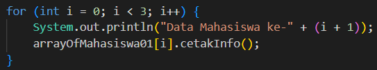
   - 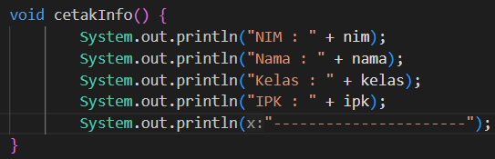
2. **Misalkan Anda punya array baru bertipe array of Mahasiswa dengan nama myArrayOfMahasiswa. Mengapa kode berikut menyebabkan error?**
   - karena objek didalam array belum di instansiasi.

---

## 3.4 Constructor Berparameter

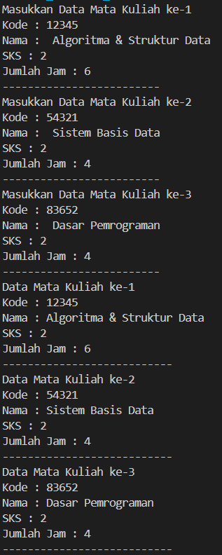

<!-- ### **Fungsi Mahasiswa01 Secara Keseluruhan**
1. Menampilkan informasi mahasiswa melalui metode `tampilkanInformasi()`.
2. Mengubah kelas mahasiswa dengan metode `ubahKelas()`.
3. Memperbarui nilai IPK dengan validasi rentang (0.0 - 4.0) melalui metode `updateIpk()`.
4. Menentukan kategori kinerja mahasiswa berdasarkan IPK dengan metode `nilaiKinerja()`. -->

### **3.4.3 Pertanyaan**

1. **Apakah suatu class dapat memiliki lebih dari 1 constructor? Jika iya, berikan contohnya**
   - bisa, 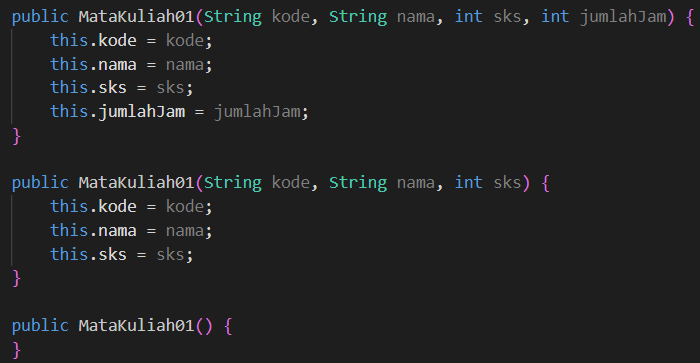
2. **Tambahkan method tambahData() pada class Matakuliah, kemudian gunakan method tersebut di class MatakuliahDemo untuk menambahkan data Matakuliah**
   - 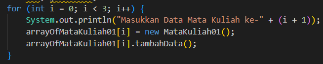
   - 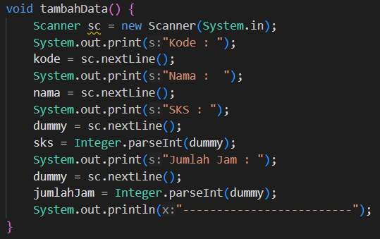
3. **Tambahkan method cetakInfo() pada class Matakuliah, kemudian gunakan method tersebut di class MatakuliahDemo untuk menampilkan data hasil inputan di layar**
   - 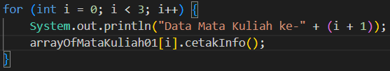
   - 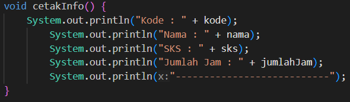
4. **Modifikasi kode program pada class MatakuliahDemo agar panjang (jumlah elemen) dari array of object Matakuliah ditentukan oleh user melalui input dengan Scanner**
     - 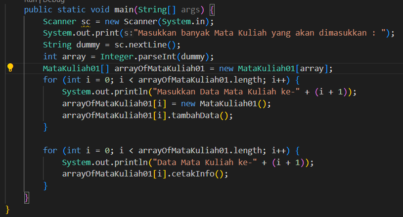

---

## 3.5 Tugas

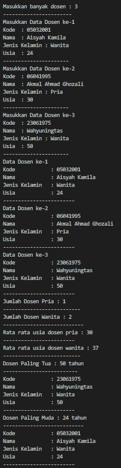
