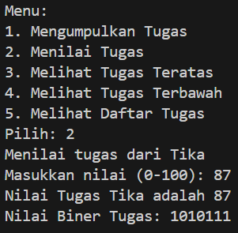
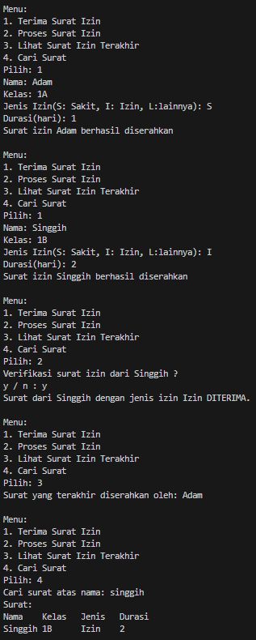

|                | Algorithm and Data Structure                                                  |
| -------------- | ----------------------------------------------------------------------------- |
| **NIM**        | 244107020207                                                                  |
| **Nama**       | Adam Bahy Maulana                                                             |
| **Kelas**      | TI - 1H                                                                       |
| **Repository** | [GitHub Repository](https://github.com/adambahyn/01_AdamBahyMaulana_PRAKALSD) |

# Jobsheet 9

## 2.1 Percobaan 1: Mahasiswa Mengumpulkan Tugas


### **2.1.3 Pertanyaan!**

1. **Lakukan perbaikan pada kode program, sehingga keluaran yang dihasilkan sama dengan verifikasi hasil percobaan! Bagian mana yang perlu diperbaiki?**
   - merubah perulangan method print()
   ```java
   for (int i = top; i >= 0; i--)
   ```
2. **Berapa banyak data tugas mahasiswa yang dapat ditampung di dalam Stack? Tunjukkan potongan kode programnya!**
   - 5 data tugas
   ```java
   StackTugasMahasiswa01 stack = new StackTugasMahasiswa01(5);
   ```
3. **Mengapa perlu pengecekan kondisi !isFull() pada method push? Kalau kondisi if-else tersebut dihapus, apa dampaknya?**
   - untuk mengecek apakah array sudah penuh, jika dihapus maka akan terjadi error jika sudah mengisi data melebihi kapasitas array
4. **Modifikasi kode program pada class MahasiswaDemo dan StackTugasMahasiswa sehingga pengguna juga dapat melihat mahasiswa yang pertama kali mengumpulkan tugas melalui operasi lihat tugas terbawah!**
   - 
   ```java
   public Mahasiswa01 peekbottom() {
        if (!isEmpty()) {
            return stack[0];
   ```
5. **Tambahkan method untuk dapat menghitung berapa banyak tugas yang sudah dikumpulkan saat ini, serta tambahkan operasi menunya!**
   - 


---

## 2.2 Percobaan 2: Konversi Nilai Tugas ke Biner 



### **2.2.3 Pertanyaan**

1. **Jelaskan alur kerja dari method konversiDesimalKeBiner!**
   - selama nilai > 0, sisa = mencari modulus nilai dengan 2, masukkan sisa ke stack, membagi nilai menjadi setengah.
   selama stack tidak kosong, biner ditambah dengan stack teratas.
   return biner.

2. **Pada method konversiDesimalKeBiner, ubah kondisi perulangan menjadi while (kode != 0), bagaimana hasilnya? Jelaskan alasannya!**
   - Hasilnya akan sama saja selama nilai bernilai positif.
---

## 2.4 Latihan Praktikum



