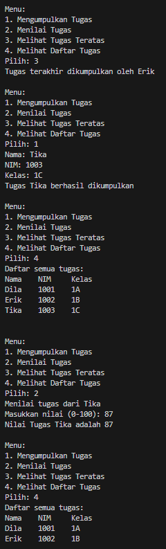
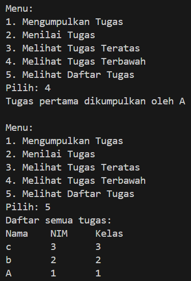
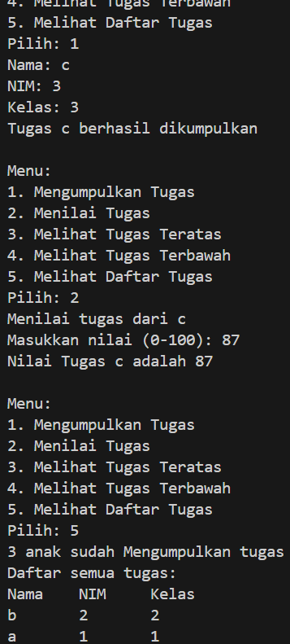

|                | Algorithm and Data Structure                                                  |
| -------------- | ----------------------------------------------------------------------------- |
| **NIM**        | 244107020207                                                                  |
| **Nama**       | Adam Bahy Maulana                                                             |
| **Kelas**      | TI - 1H                                                                       |
| **Repository** | [GitHub Repository](https://github.com/adambahyn/01_AdamBahyMaulana_PRAKALSD) |

# Jobsheet 9

## 2.1 Percobaan 1: Mahasiswa Mengumpulkan Tugas



### **2.1.3 Pertanyaan!**

1. **Lakukan perbaikan pada kode program, sehingga keluaran yang dihasilkan sama dengan verifikasi hasil percobaan! Bagian mana yang perlu diperbaiki?**
   - merubah perulangan method print()
   ```java
   for (int i = top; i >= 0; i--)
   ```
2. **Berapa banyak data tugas mahasiswa yang dapat ditampung di dalam Stack? Tunjukkan potongan kode programnya!**
   - 5 data tugas
   ```java
   StackTugasMahasiswa01 stack = new StackTugasMahasiswa01(5);
   ```
3. **Mengapa perlu pengecekan kondisi !isFull() pada method push? Kalau kondisi if-else tersebut dihapus, apa dampaknya?**
   - untuk mengecek apakah array sudah penuh, jika dihapus maka akan terjadi error jika sudah mengisi data melebihi kapasitas array
4. **Modifikasi kode program pada class MahasiswaDemo dan StackTugasMahasiswa sehingga pengguna juga dapat melihat mahasiswa yang pertama kali mengumpulkan tugas melalui operasi lihat tugas terbawah!**
   - 
   ```java
   public Mahasiswa01 peekbottom() {
        if (!isEmpty()) {
            return stack[0];
   ```
5. **Tambahkan method untuk dapat menghitung berapa banyak tugas yang sudah dikumpulkan saat ini, serta tambahkan operasi menunya!**
   - 


---

## 6.3. Searching / Pencarian Menggunakan Binary Search


### **6.3.3 Pertanyaan**

1. **Tunjukkan pada kode program yang mana proses divide dijalankan!**

   - ```java
      if (cari == listMhs[mid].ipk)
         return (mid);
      else if (listMhs[mid].ipk > cari)
         return findBinarySearch(cari, left, mid - 1);
      else
         return findBinarySearch(cari, mid + 1, right);

     ```

2. **Tunjukkan pada kode program yang mana proses conquer dijalankan!**
   - ```java
        if (cari == listMhs[mid].ipk) {
                return (mid);
        }
     ```
3. **Jika data IPK yang dimasukkan tidak urut. Apakah program masih dapat berjalan? Mengapa demikian!**
   - tidak bisa, karena binary searching bekerja dengan cara membagi data menjadi 2 bagian, jika yang dicari lebih besar/kecil, maka akan melanjutkan pencarian kearah yang sudah ditentukan.
4. **Jika IPK yang dimasukkan dari IPK terbesar ke terkecil (missal : 3.8, 3.7, 3.5, 3.4, 3.2) dan elemen yang dicari adalah 3.2. Bagaimana hasil dari binary search? Apakah sesuai? Jika tidak sesuai maka ubahlah kode program binary seach agar hasilnya sesuai**
   - tidak sesuai,
   ```java
   else if (listMhs[mid].ipk < cari) {
         return findBinarySearch(cari, left, mid - 1);
   } else {
         return findBinarySearch(cari, mid + 1, right);
   }
   ```
5. **Modifikasilah program diatas yang mana jumlah mahasiswa yang di inputkan sesuai dengan masukan dari keyboard.**
   - ```java
      int jumMhs = sc.nextInt();
      sc.nextLine();
      MahasiswaBerprestasi01 list = new MahasiswaBerprestasi01(jumMhs);
     ```

---

## 6.5 Latihan Praktikum


