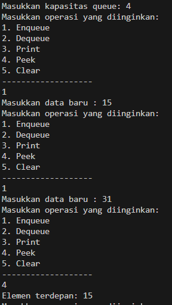
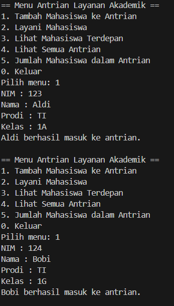
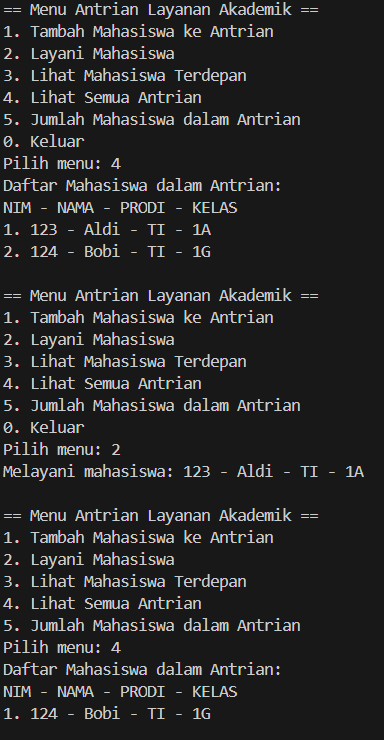
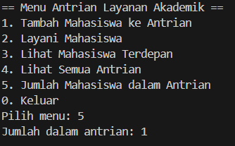
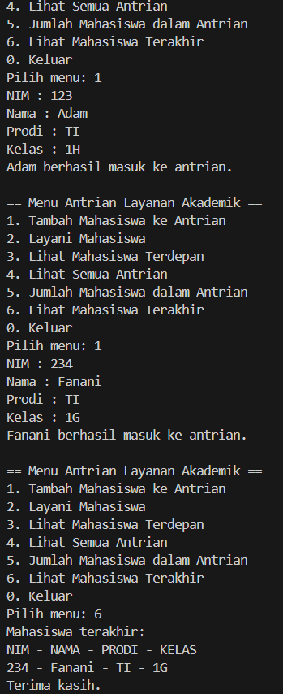
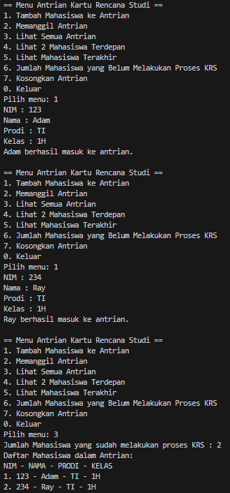
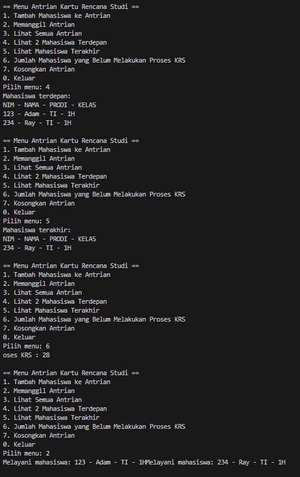

|                | Algorithm and Data Structure                                                  |
| -------------- | ----------------------------------------------------------------------------- |
| **NIM**        | 244107020207                                                                  |
| **Nama**       | Adam Bahy Maulana                                                             |
| **Kelas**      | TI - 1H                                                                       |
| **Repository** | [GitHub Repository](https://github.com/adambahyn/01_AdamBahyMaulana_PRAKALSD) |

# Jobsheet 11

## 2.1 Percobaan 1 : Operasi Dasar Queue



### **2.1.3 Pertanyaan!**

1. **Pada konstruktor, mengapa nilai awal atribut front dan rear bernilai -1, sementara atribut size bernilai 0?**
   - agar saat diinput nilai pertama kali, front dan rear berubah menjadi 0 tidak 1, dan size akan menjadi 1
2. **Pada method Enqueue, jelaskan maksud dan kegunaan dari potongan kode berikut!**
   -jika antrian paling belakang sudah memenuhi array, maka antrian ditaruh di array paling depan
3. **Pada method Dequeue, jelaskan maksud dan kegunaan dari potongan kode berikut!**
   - jika antrian paling depan sudah memenuhi array, maka antrian ditaruh di array paling depan lagi
4. **Pada method print, mengapa pada proses perulangan variabel i tidak dimulai dari 0 (int i=0), melainkan int i=front?**
   - karena antrian paling depan tidak selalu berada di array indeks 0
5. **Perhatikan kembali method print, jelaskan maksud dari potongan kode berikut!**
   - agar jika sudah sampai akhir array dan belum menemukan rear, maka kembali ke array indeks 0
6. **Tunjukkan potongan kode program yang merupakan queue overflow!**
   -  ```java
         if (IsFull()) {
         System.out.println("Queue sudah penuh");
      }
      ```
7. **Pada saat terjadi queue overflow dan queue underflow, program tersebut tetap dapat berjalan dan hanya menampilkan teks informasi. Lakukan modifikasi program sehingga pada saat terjadi queue overflow dan queue underflow, program dihentikan!**
   - ```java
      if (IsEmpty()) {
               System.out.println("Queue masih kosong");
               System.exit(1);
         }
      if (IsFull()) {
            System.out.println("Queue sudah penuh");
            System.exit(1);
        }   
     ```   


---

## 2.2. Percobaan 2 : Antrian Layanan Akademik





### **2.2.3 Pertanyaan**

**Lakukan modifikasi program dengan menambahkan method baru bernama LihatAkhir pada class AntrianLayanan yang digunakan untuk mengecek antrian yang berada di posisi belakang. Tambahkan pula daftar menu 6. Cek Antrian paling belakang pada class LayananAkademikSIAKAD sehingga method LihatAkhir dapat dipanggil!**
- 

---

## 2.4 Latihan Praktikum




