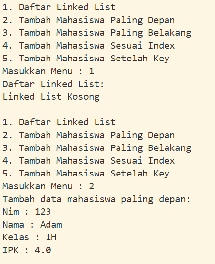

|                | Algorithm and Data Structure                                                  |
| -------------- | ----------------------------------------------------------------------------- |
| **NIM**        | 244107020207                                                                  |
| **Nama**       | Adam Bahy Maulana                                                             |
| **Kelas**      | TI - 1H                                                                       |
| **Repository** | [GitHub Repository](https://github.com/adambahyn/01_AdamBahyMaulana_PRAKALSD) |

# Jobsheet 12 Linked List

## 2.1 Pembuatan Single Linked List

### **2.1.2 Pertanyaan!**

1. **Mengapa hasil compile kode program di baris pertama menghasilkan “Linked List Kosong”?**
   - Karena di awal belum melakukan instansiasi maupun menjalankan method add.
2. **Jelaskan kegunaan variable temp secara umum pada setiap method!**
   - Agar dapat dilakukan iterasi ke tiap node tanpa memindah head dan tail.
3. **Lakukan modifikasi agar data dapat ditambahkan dari keyboard!**
   - 
---

## 2.2 Modifikasi Elemen pada Single Linked List

### **2.2.3 Pertanyaan**

1. **Mengapa digunakan keyword break pada fungsi remove? Jelaskan!**
   - agar tidak menjalankan kode dibawah nya jika sudah terpenuhi kondisi if.
2. **Jelaskan kegunaan kode dibawah pada method remove**
   - memindahkan node selanjutnya dari temp ke selanjutnya lagi, jika node setelah temp itu kosong maka temp dijadikan tail.

---

## 3. Tugas

