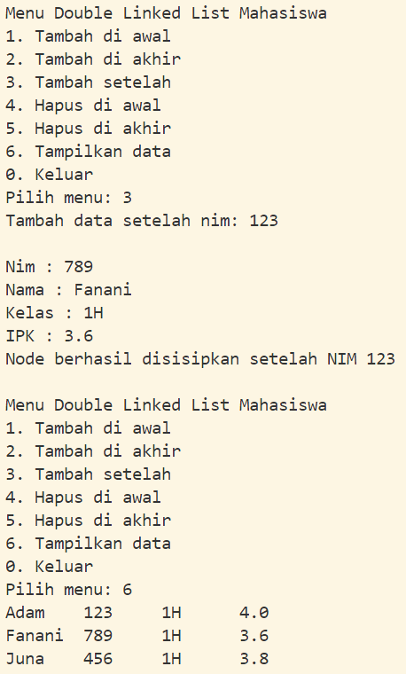
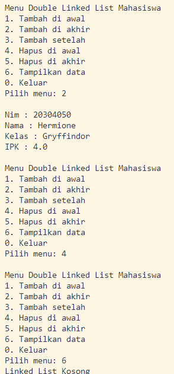
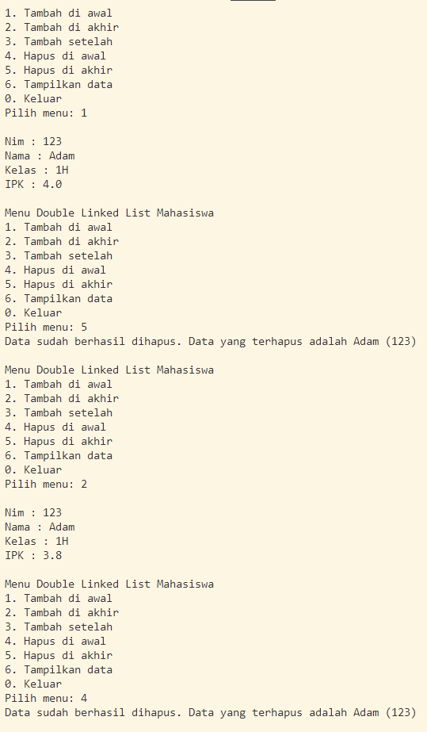

|                | Algorithm and Data Structure                                                  |
| -------------- | ----------------------------------------------------------------------------- |
| **NIM**        | 244107020207                                                                  |
| **Nama**       | Adam Bahy Maulana                                                             |
| **Kelas**      | TI - 1H                                                                       |
| **Repository** | [GitHub Repository](https://github.com/adambahyn/01_AdamBahyMaulana_PRAKALSD) |

# Jobsheet 13 Double Linked List

## 12.2.1 Percobaan 1


### **12.2.3 Pertanyaan Percobaan**

1. **Jelaskan perbedaan antara single linked list dengan double linked lists!**
   - Double linked list punya 2 pointer, bisa mengarah secara transversal tidak hanya ke depan
2. **Perhatikan class Node01, di dalamnya terdapat atribut next dan prev. Untuk apakah atribut tersebut?**
   - next untuk pergi ke node selanjutnya, prev untuk pergi ke node sebelumnya
3. **Perhatikan konstruktor pada class DoubleLinkedLists. Apa kegunaan dari konstruktor tersebut?**
   - untuk set head dan tail nya kosong saat diinstasiasi pertama kali, karena belum ada node.
4. **Pada method addFirst(), apa maksud dari kode berikut?**
   - menambah data baru sebagai head dan tail.
5. **Perhatikan pada method addFirst(). Apakah arti statement head.prev = newNode ?**
   - menyambungkan prev dari head ke data baru
6. **Modifikasi code pada fungsi print() agar dapat menampilkan warning/ pesan bahwa linked lists masih dalam kondisi.**
   -  ```java
      if (isEmpty()) {
               System.out.println("Linked List Kosong");
         }
      ```
7. **Pada insertAfter(), apa maksud dari kode berikut ?**
   - menyambungkan node setelah current ke node baru sebagai prev
8. **Modifikasi menu pilihan dan switch-case agar fungsi insertAfter() masuk ke dalam menu pilihan dan dapat berjalan dengan baik.**
   - 
---

## 12.3 Kegiatan Praktikum 2



### **2.2.3 Pertanyaan**

1. **Apakah maksud statement berikut pada method removeFirst()?**
   - memindah posisi head ke node selanjutnya, dan membuat prev dari head baru menjadi null.
2. **Modifikasi kode program untuk menampilkan pesan “Data sudah berhasil dihapus.Data yang terhapus adalah … “**
   - 


---

## 3. Tugas


