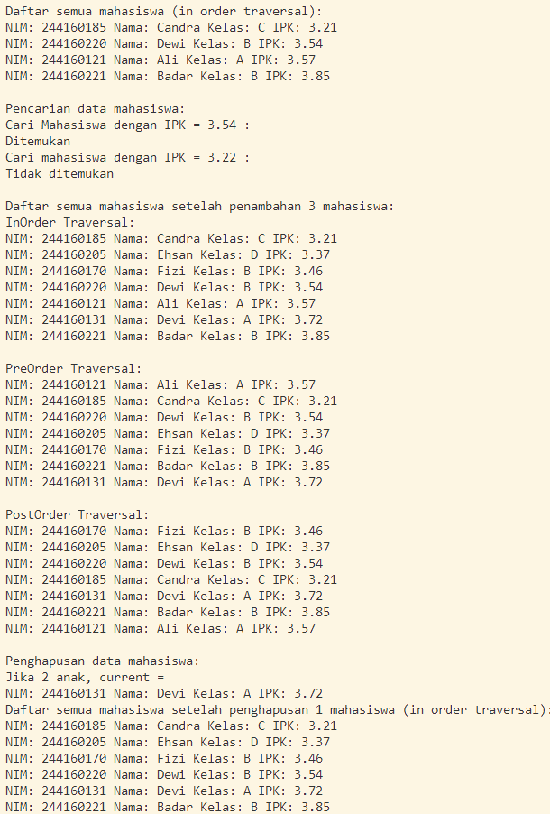
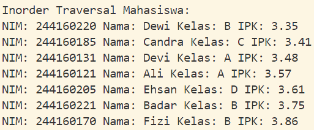

|                | Algorithm and Data Structure                                                  |
| -------------- | ----------------------------------------------------------------------------- |
| **NIM**        | 244107020207                                                                  |
| **Nama**       | Adam Bahy Maulana                                                             |
| **Kelas**      | TI - 1H                                                                       |
| **Repository** | [GitHub Repository](https://github.com/adambahyn/01_AdamBahyMaulana_PRAKALSD) |

# Jobsheet 14 Tre

## 14.2.1 Percobaan 1



### **14.2.2 Pertanyaan Percobaan**

1. **Mengapa dalam binary search tree proses pencarian data bisa lebih efektif dilakukan dibanding binary tree biasa?**
   - karena nilai dalam bst tersusun child sebelah kiri lebih kecil dari parent dan child sebelah kanan lebih besar dari parent, membuat proses pencarian nilai lebih mudah dan efektif
2. **Untuk apakah di class Node, kegunaan dari atribut left dan right?**
   - untuk pergi ke child sebelah kanan maupun kiri
3. **a. Untuk apakah kegunaan dari atribut root di dalam class BinaryTree?**
   - untuk mendifine node paling atas sebagai patokan saat ingin melakukan proses lain di tree tersebut
**b. Ketika objek tree pertama kali dibuat, apakah nilai dari root?**
   - jika di konstruktor root = null, maka tree bernilai null
4. **Ketika tree masih kosong, dan akan ditambahkan sebuah node baru, proses apa yang akan terjadi?**
   - menambah data baru sebagai root
5. **Perhatikan method add(), di dalamnya terdapat baris program seperti di bawah ini. Jelaskan secara detil untuk apa baris program tersebut?**
   - menambahkan data baru ke node kosong sesuai besarnya nilai terhadap parentnya
6. **Jelaskan langkah-langkah pada method delete() saat menghapus sebuah node yang memiliki dua anak. Bagaimana method getSuccessor() membantu dalam proses ini?**
   - mencari anak paling kiri subtree current kanan, memindah anak kiri current menjadi anaknya anak kanan dari current, memindah anak kanan menjadi current
---

## 14.3.1 Tahapan Percobaan



### **2.2.3 Pertanyaan**

1. **Apakah kegunaan dari atribut data dan idxLast yang ada di class BinaryTreeArray?**
   - data sebagai array dari class mahasiswa, idxLast sebagai penanda akhir index array data
2. **Apakah kegunaan dari method populateData()?**
   - untuk mengisi array data dan idxLast
2. **Apakah kegunaan dari method traverseInOrder()?**
   - menampilkan tree secara rekursif dari anak kiri -> akar -> anak kanan
2. **Jika suatu node binary tree disimpan dalam array indeks 2, maka di indeks berapakah posisileft child dan rigth child masing-masing?**
   - 5 dan 6
2. **Apa kegunaan statement int idxLast = 6 pada praktikum 2 percobaan nomor 4?**
   - menandai akhir dari index array data
2. **Mengapa indeks `2*idxStart+1` dan `2*idxStart+2`digunakan dalam pemanggilan rekursif, dan apa kaitannya dengan struktur pohon biner yang disusun dalam array?**
   - 2*idxStart+1 merupakan indeks anak kiri dari parent.
   2*idxStart+2 merupakan indeks anak kanan dari parent.


---

## 3. Tugas
1. 
```java
public void addRekursif(Mahasiswa01 mhs) {
        root=tambahRekursif(root, mhs);
    }

    private Node01 tambahRekursif(Node01 current, Mahasiswa01 mhs) {
        if (current == null) {
            return new Node01(mhs);
        }

        if (mhs.ipk < current.mahasiswa.ipk) {
            current.left = tambahRekursif(current.left, mhs);
        } else {
            current.right = tambahRekursif(current.right, mhs);
        }
        return current;
    }
```
2. 
```java
    public Mahasiswa01 cariMinIPK() {
        if (isEmpty())
            return null;

        Node01 current = root;
        while (current.left != null) {
            current = current.left;
        }
        return current.mahasiswa;
    }

    public Mahasiswa01 cariMaxIPK() {
        if (isEmpty())
            return null;

        Node01 current = root;
        while (current.right != null) {
            current = current.right;
        }
        return current.mahasiswa;
    }

    public void tampilMahasiswaIPKdiAtas(double ipkBatas) {
        tampilIPKLebih(root, ipkBatas);
    }

    private void tampilIPKLebih(Node01 node, double ipkBatas) {
        if (node != null) {
            tampilIPKLebih(node.left, ipkBatas);
            if (node.mahasiswa.ipk > ipkBatas) {
                node.mahasiswa.tampilInformasi();
            }
            tampilIPKLebih(node.right, ipkBatas);
        }
    }

```
3. 
```java
void add(Mahasiswa01 data) {
        if (idxLast + 1 < dataMahasiswa.length) {
            idxLast++;
            dataMahasiswa[idxLast] = data;
        } else {
            System.out.println("Tree penuh, tidak bisa menambah data.");
        }
    }

    void traversePreOrder(int idxStart) {
        if (idxStart <= idxLast) {
            if (dataMahasiswa[idxStart] != null) {
                dataMahasiswa[idxStart].tampilInformasi(); // Akar
                traversePreOrder(2 * idxStart + 1); // Kiri
                traversePreOrder(2 * idxStart + 2); // Kanan
            }
        }
    }

```

