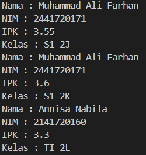
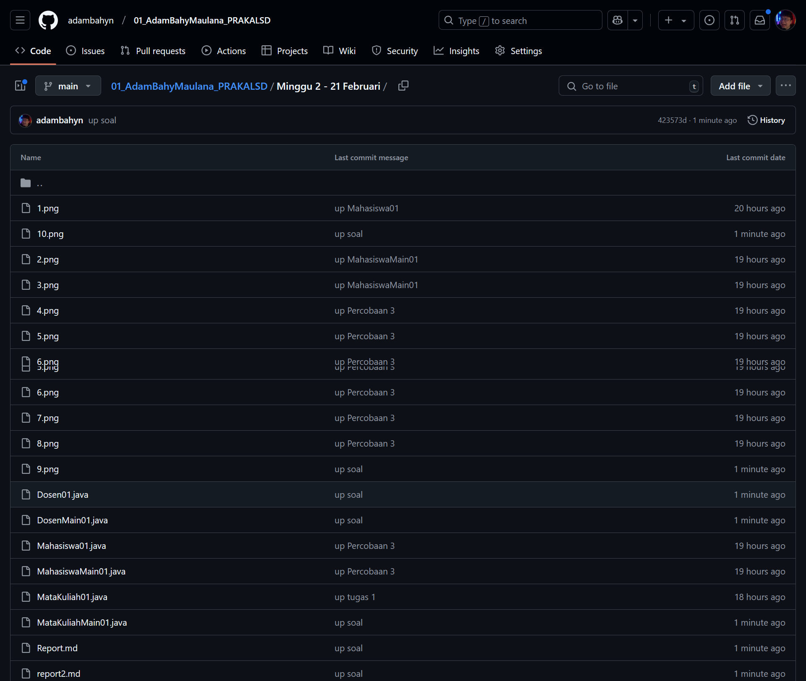
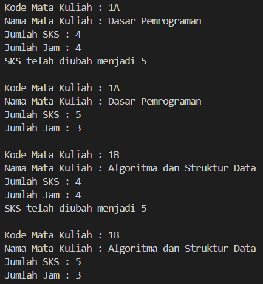
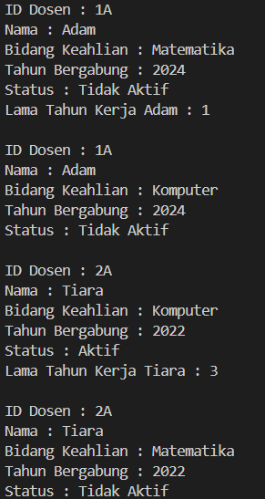

|  | Algorithm and Data Structure |
|--|--|
| **NIM** |  244107020207 |
| **Nama** |  Adam Bahy Maulana |
| **Kelas** | TI - 1H |
| **Repository** | [GitHub Repository](https://github.com/adambahyn/01_AdamBahyMaulana_PRAKALSD) |

# Jobsheet 2

## 2.1 Percobaan 1: Deklarasi Class, Atribut, dan Method


### **2.1.3 Pertanyaan**
1. **Sebutkan dua karakteristik class atau object!**
   - Class adalah rancangan atau template dari entitas yang nyata. Class memiliki atribut dan method, serta metode khusus bernama konstruktor.
2. **Perhatikan class Mahasiswa pada Praktikum 1 tersebut, ada berapa atribut yang dimiliki oleh class Mahasiswa? Sebutkan apa saja atributnya!**
   - Terdapat 4 atribut: `nama`, `nim`, `kelas`, dan `ipk`.
3. **Ada berapa method yang dimiliki oleh class tersebut? Sebutkan apa saja methodnya!**
   - Terdapat 4 method: `tampilkanInformasi()`, `ubahKelas(String kelasBaru)`, `updateIpk(double ipkBaru)`, dan `nilaiKinerja()`.
4. **Perbaiki kesalahan pada potongan kode berikut!**
   ```java
   if (ipkBaru >= 0.0 && ipkBaru <= 4.0) {
       ipk = ipkBaru;
   } else {
       System.out.println("IPK tidak valid. Harus antara 0.0 dan 4.0");
   }
   ```
5. **Jelaskan bagaimana cara kerja method nilaiKinerja() dalam mengevaluasi kinerja mahasiswa, kriteria apa saja yang digunakan untuk menentukan nilai kinerja tersebut, dan apa yang dikembalikan (di-return-kan) oleh method nilaiKinerja() tersebut?**
   - Method ini memeriksa nilai IPK menggunakan `if-else` dan mengembalikan `String` sesuai kondisi yang terpenuhi.
6. **Commit Github :**
   

---

## 2.2 Percobaan 2: Instansiasi Object, serta Mengakses Atribut dan Method


### **2.2.3 Pertanyaan**
1. **. Pada class MahasiswaMain, tunjukkan baris kode program yang digunakan untuk proses instansiasi! Apa nama object yang dihasilkan?**
   - `mhs1` 
2. **Bagaimana cara mengakses atribut dan method dari suatu objek?**
   - **Atribut:** `objek.atribut`
   - **Method:** `objek.method()`
3. **Mengapa hasil output pemanggilan method tampilkanInformasi() pertama dan kedua berbeda?**
   - Karena atribut `kelas` dan `ipk` dari objek `mhs1` telah diubah.

---

## 2.3 Percobaan 3: Membuat Konstruktor



### **Fungsi Mahasiswa01 Secara Keseluruhan**
1. Menampilkan informasi mahasiswa melalui metode `tampilkanInformasi()`.
2. Mengubah kelas mahasiswa dengan metode `ubahKelas()`.
3. Memperbarui nilai IPK dengan validasi rentang (0.0 - 4.0) melalui metode `updateIpk()`.
4. Menentukan kategori kinerja mahasiswa berdasarkan IPK dengan metode `nilaiKinerja()`.

### **2.3.3 Pertanyaan**
1. **. Pada class Mahasiswa di Percobaan 3, tunjukkan baris kode program yang digunakan untuk mendeklarasikan konstruktor berparameter!**
   
2. **Perhatikan class MahasiswaMain. Apa sebenarnya yang dilakukan pada baris program berikut?**
   - Objek `mhs2` dibuat menggunakan konstruktor dengan parameter.
3. **Hapus konstruktor default pada class Mahasiswa, kemudian compile dan run program. Bagaimana hasilnya? Jelaskan mengapa hasilnya demikian!**
   - Bisa, karena di `MahasiswaMain01` terdapat konstruktor tanpa parameter. 
4. **Setelah melakukan instansiasi object, apakah method di dalam class Mahasiswa harus diakses secara berurutan? Jelaskan alasannya!**
   - Tidak, karena Java menjalankan method sesuai urutan pemanggilan dalam `main()`.
5. **Buat object baru dengan nama mhs<NamaMahasiswa> menggunakan konstruktor berparameter dari class Mahasiswa!**
   
6. **Commit Github :**
   


---

## 2.4 Latihan Praktikum

### **1. Class MataKuliah01**


**Fungsi MataKuliah01 Secara Keseluruhan:**
1. Menampilkan informasi mata kuliah melalui metode `tampilInformasi()`.
2. Mengubah jumlah SKS dengan metode `ubahSKS()`.
3. Menambah jumlah jam pertemuan dengan metode `tambahJam()`.
4. Mengurangi jumlah jam pertemuan dengan metode `kurangiJam()`, yang dilengkapi validasi agar jumlah jam tidak menjadi negatif.

### **2. Class Dosen01**


**Fungsi Dosen01 Secara Keseluruhan:**
1. Menampilkan informasi dosen melalui metode `tampilInformasi()`.
2. Mengubah status aktif dosen dengan metode `setStatusAktif()`.
3. Menghitung masa kerja dosen berdasarkan tahun saat ini dengan metode `hitungMasaKerja()`.
4. Mengubah bidang keahlian dosen dengan metode `ubahKeahlian()`.

