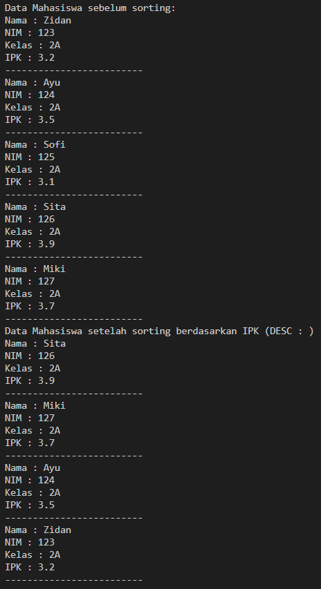

|                | Algorithm and Data Structure                                                  |
| -------------- | ----------------------------------------------------------------------------- |
| **NIM**        | 244107020207                                                                  |
| **Nama**       | Adam Bahy Maulana                                                             |
| **Kelas**      | TI - 1H                                                                       |
| **Repository** | [GitHub Repository](https://github.com/adambahyn/01_AdamBahyMaulana_PRAKALSD) |

# Jobsheet 6

## 6.2 Praktikum 1 - Mengimplementasikan Sorting menggunakan object 


### **5.2.3. Pertanyaan**

1. **Pada base line Algoritma Divide Conquer untuk melakukan pencarian nilai faktorial, jelaskan perbedaan bagian kode pada penggunaan if dan else!**
   - Bagian kode if dijalankan ketika kondisi n == 1 atau sudah mencapai base case dan menghentika rekursi
   - Bagian else dijalankan ketika kondisi tidak memenuhi if dan menjalankan rekursi untuk memecah masalah menjadi bagian yang lebih kecil hingga mencapai base case
2. **Apakah memungkinkan perulangan pada method faktorialBF() diubah selain menggunakan for? Buktikan!**
   ```java
     while (i <= n) {
              fakto = fakto * i;
              i++;
          }
   ```
3. **Jelaskan perbedaan antara fakto _= i; dan int fakto = n _ faktorialDC(n-1); !**
   - fakto \*= i digunakan sebagai iteratif Brute Force menggunakan perulangan
   - fakto = n \* faktorialDC(n-1); digunakan sebagai pemanggilan rekursif dengan metode divide and conquer
4. **Buat Kesimpulan tentang perbedaan cara kerja method faktorialBF() dan faktorialDC()!**
   - faktorialBF bekerja dengan menggunakan loop didalam method itu sendiri
   - faktorialDC bekerja dengan memecah permasalahan menjadi bagian paling kecil dengan pemanggilan rekursif

---

## 5.3 Menghitung Hasil Pangkat dengan Algoritma Brute Force dan Divide and Conquer



### **5.3.3 Pertanyaan**

1. **Jelaskan mengenai perbedaan 2 method yang dibuat yaitu pangkatBF() dan pangkatDC()!**
   - pangkatBF() menggunakan metode Brute Force dengan loop for
   - PangkatDC() menggunakan metode Divide and Conquer dengan pemanggilan rekursif
2. **Apakah tahap combine sudah termasuk dalam kode tersebut?Tunjukkan!**
   - sudah, jika pangkatDC() sudah mencapai base case maka ia akan mengembalikan nilai a dan mengalikan dengan semua pemanggilan rekursif yang telah di dipanggil
   ```java
     int pangkatDC(int a, int n) {
        if (n==1) {
            return a;
        } else {
            if (n%2==1) {
                return (pangkatDC(a, n / 2) * pangkatDC(a, n / 2) * a);
            } else {
                return  (pangkatDC(a, n / 2) * pangkatDC(a, n / 2));
            }
        }
    }
   ```
3. **Pada method pangkatBF() terdapat parameter untuk melewatkan nilai yang akan dipangkatkan dan pangkat berapa, padahal di sisi lain di class Pangkat telah ada atribut nilai dan pangkat, apakah menurut Anda method tersebut tetap relevan untuk memiliki parameter? Apakah bisa jika method tersebut dibuat dengan tanpa parameter? Jika bisa, seperti apa method pangkatBF() yang tanpa parameter?**
   - ```java
       int pangkatBF() {
        int hasil = 1;
        for (int i = 0; i < pangkat; i++) {
            hasil = hasil * nilai;
        }
        return hasil;
      }
    ```
4. **Tarik tentang cara kerja method pangkatBF() dan pangkatDC()!**
   - pangkatBF() bekerja menggunakan metode Brute Force dengan mengalikan nilai sebanyak pangkat menggunakan perulangan didalam method itu sendiri
   - pangkatDC() bekerja menggunakan metode Divide and Conquer dengan memanggil method rekursif sehingga menghasilkan nilai sebanyak pangkat untuk dikalikan

---

## 5.4 Menghitung Sum Array dengan Algoritma Brute Force dan Divide and Conquer


### **5.4.3 Pertanyaan**

1. **Kenapa dibutuhkan variable mid pada method TotalDC()?**
   - untuk membagi dua array bagian kanan dan kiri untuk di Divide and Conquer
2. **Untuk apakah statement di bawah ini dilakukan dalam TotalDC()?**
   - pemanggilan rekursi method untuk memecah array hingga mencapai base case
3. **Kenapa diperlukan penjumlahan hasil lsum dan rsum seperti di bawah ini?**
   - untuk combine hasil pemanggilan rekursi menjadi hasil yang diinginkan
4. **Apakah base case dari totalDC()?**
   - hingga tersisa satu index dari array yang akan di return ke pemanggilan rekursi sebelumnya
5. **Tarik Kesimpulan tentang cara kerja totalDC()**
   - membagi dua array yang di masukkan dalam parameter, memanggil rekursi untuk membagi lagi array hingga mencapai base case, pada akhirnya menjumlah semua index dalam array untuk di return 

---

## 4.5 Latihan Praktikum


