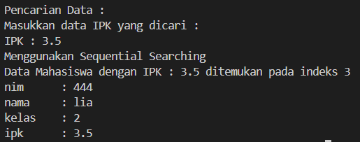
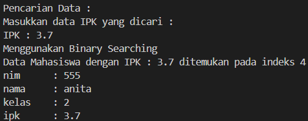
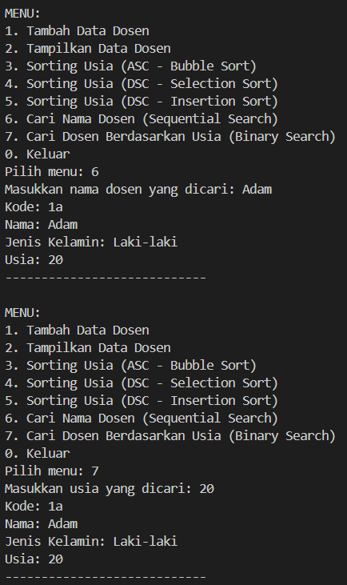

|                | Algorithm and Data Structure                                                  |
| -------------- | ----------------------------------------------------------------------------- |
| **NIM**        | 244107020207                                                                  |
| **Nama**       | Adam Bahy Maulana                                                             |
| **Kelas**      | TI - 1H                                                                       |
| **Repository** | [GitHub Repository](https://github.com/adambahyn/01_AdamBahyMaulana_PRAKALSD) |

# Jobsheet 6

## 6.2. Searching / Pencarian Menggunakan Agoritma Sequential Search



### **6.2.3 Pertanyaan!**

1. **. Jelaskan perbedaan metod tampilDataSearch dan tampilPosisi pada class MahasiswaBerprestasi!**
   - method tampilPosisi hanya berfungsi untuk menampilkan bahwa data yang dicari dalam array ada atau tidak, method tampilDataSearch berfungsi untuk menampilkan informasi lain yang dicari dari indeks array yang sama ketika ditemukan
2. **Jelaskan fungsi break pada kode program dibawah ini!**
  - untuk menghentikan perulangan jika kondisi(ipk == cari) benar dan me return posisi yang sudah diganti

---

## 5.3 Praktikum 2- (Sorting Menggunakan Array of Object)



### **5.3.4 Pertanyaan**

1. **Perhatikan perulangan di dalam bubbleSort() di bawah ini:**
   a. **Mengapa syarat dari perulangan i adalah ?**
   ```java
      i<listMhs.length-1
   ```
   karena di Bubble Sort, setelah penyortiran atau perulangan dilakukan selama n-1 kali, maka elemen terakhir sudah akan berada di posisi yang benar
   b. **Mengapa syarat dari perulangan j adalah**
   ```java
      j<listMhs.length-i
   ```
   Agar tidak membandingkan elemen yang posisi nya sudah benar
   c. **Jika  banyak  data  di  dalam  listMhs  adalah  50,  maka berapakali perulangan i akan berlangsung? Dan ada berapa Tahap bubble sort yang ditempuh?**
   Perulangan i ber iterasi selama 49 kali, dan juga ada 49 tahap Bubble Sort

2. **Modifikasi program diatas dimana data mahasiswa bersifat dinamis (input dari keyborad) yang terdiri dari nim, nama, kelas, dan ipk!**
   - 


## 5.3.5 Mengurutkan Data Mahasiswa Berdasarkan IPK (Selection Sort)


### **5.3.7 Pertanyaan**

1. **Di dalam method selection sort, terdapat baris program seperti di bawah ini:**
**Untuk apakah proses tersebut, jelaskan!**
   - untuk menemukan index elemen dengan nilai ipk terkecil yang nanti akan ditukar dengan bagian array yang belum disortir.

## 5.4 Mengurutkan Data Mahasiswa Berdasarkan IPK Menggunakan Insertion Sort


### **5.4.3 Pertanyaan**

1. **Ubahlah fungsi pada InsertionSort sehingga fungsi ini dapat melaksanakan proses sorting dengan cara descending.**
   - 


---

## 5.5 Latihan Praktikum


